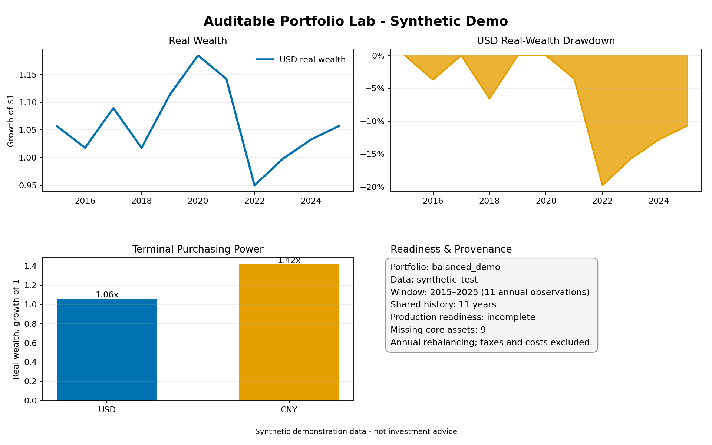
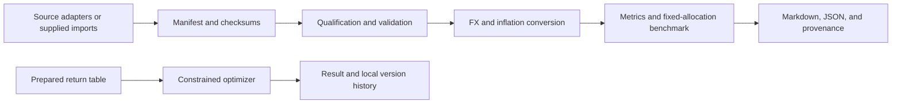

# Auditable Portfolio Lab

A local-first Python toolkit for evaluating fixed-allocation portfolios across currencies with explicit data lineage, inflation-adjusted results, and reproducible reports.

[](https://github.com/zzhang87/auditable-portfolio-lab/actions/workflows/ci.yml)




The chart above comes from the bundled synthetic sample. It illustrates the workflow and is not historical performance or investment advice.

## Why this exists

Cross-market portfolio analysis becomes difficult to audit when asset returns, FX conversion, inflation, data selection, and missing history are handled as unrelated spreadsheet steps. Small convention changes can alter the result without leaving a useful record of what happened.

Auditable Portfolio Lab treats those choices as part of the calculation. Inputs are described by a manifest, selected data is validated before use, USD and CNY purchasing-power views share one complete interval, and every benchmark writes its assumptions and provenance alongside the results.

## What it does

| Workflow | Result |
|---|---|
| Validate manifests, source metadata, reference evidence, and file checksums | Unqualified or changed inputs fail before evaluation |
| Align asset, FX, and inflation observations | One explicit complete interval for every requested view |
| Convert returns and deflate purchasing power | Separate nominal and real results in USD and CNY |
| Evaluate fixed weights with annual rebalancing | Return, volatility, drawdown, start-date, and withdrawal metrics when enough history exists |
| Write Markdown, JSON, and checksum metadata | Inspectable output for people and downstream tools |
| Search constrained allocations from prepared return tables | Seeded heuristic optimization with feasibility reported explicitly |
| Store portfolio and run lineage locally | SQLite-backed parent/child versions and reproducible run settings |

The manifest-backed benchmark and the optimizer are intentionally separate. The optimizer consumes a prepared return table; it does not silently qualify or transform market data.

## Quick start

Requires Python 3.10+ and Git.

```bash
git clone https://github.com/zzhang87/auditable-portfolio-lab.git
cd auditable-portfolio-lab
python -m venv .venv
source .venv/bin/activate
pip install -e ".[dev,viz]"
```

Run the bundled sample from the repository root:

```bash
pcopt benchmark \
  --manifest examples/demo/manifest.json \
  --weights examples/demo/portfolio.json \
  --base-currency both \
  --output-dir reports/demo \
  --allow-synthetic-demo

python scripts/render_demo_chart.py \
  --report reports/demo/benchmark.json \
  --output reports/demo/benchmark-overview.png
```

The benchmark itself runs offline from checked-in inputs. Inspect these files afterward:

- `reports/demo/benchmark.md` — readable results, assumptions, availability, and coverage
- `reports/demo/benchmark.json` — structured results and selected observations
- `reports/demo/benchmark.provenance.json` — artifact checksums
- `reports/demo/benchmark-overview.png` — compact visual summary

The same output is checked in under [reports/example](reports/example/) for browsing without installation.

## Example result

The sample evaluates a 60% synthetic growth / 40% synthetic defensive allocation using 11 annual observations labeled 2015–2025.

| Purchasing-power view | Nominal CAGR | Real CAGR | Real volatility | Deepest real drawdown |
|---|---:|---:|---:|---:|
| USD | 3.45% | 0.51% | 7.74% | -19.76% |
| CNY | 4.71% | 3.21% | 5.77% | -6.49% |

The allocation is unchanged between views. FX and inflation assumptions change its measured purchasing power. Start-date sensitivity and withdrawal metrics remain unavailable because the sample is too short; the generated report records the missing horizons instead of filling them with estimates.

All bundled return, FX, inflation, and reference values are repository-authored synthetic data. See [data and limitations](docs/data-and-limitations.md) before interpreting any output.

## How it works



The [architecture guide](docs/architecture.md) describes the component boundaries, failure model, and reproduction contract.

## Using your own data

A benchmark bundle contains:

- annual nominal asset returns;
- observed year-end FX values;
- annual inflation observations;
- reference observations used during qualification;
- a manifest describing series identity, return basis, currency, coverage, source metadata, and checksums;
- one or more named portfolio weight sets.

Use [examples/demo](examples/demo/) as the schema reference. The builders in [scripts](scripts/) and adapters in [pcopt/market_sources](pcopt/market_sources/) support local preparation from permitted inputs. Source access and redistribution rights remain the user's responsibility.

The default benchmark path rejects synthetic inputs. `--allow-synthetic-demo` exists only for the bundled sample and preserves its `synthetic_test` identity and incomplete readiness status.

## Reproducibility

Verify a generated sample against the checked-in semantic result and its own artifact checksums:

```bash
python scripts/verify_demo.py \
  --expected examples/demo/expected \
  --actual reports/demo
```

Reproduction depends on the same input bytes, manifest identity, qualification cutoff, portfolio definition, and calculation settings. The report records the selected observations and a replay command. See [evaluation](docs/evaluation.md) for the test layers and release gates.

## Optimization and local history

`GeneticOptimizer` searches supplied return tables using weighted objectives, metric constraints, and a fixed random seed. Results include their feasibility status. The CLI can persist optimizer runs and portfolio versions to SQLite, including parent/child relationships and the settings needed to inspect a run later.

```bash
pcopt optimize \
  --returns examples/sample_annual_real_returns.csv \
  --assets steady,growth,cash \
  --objective cagr=1 ulcer_index=-0.2 \
  --constraint 'standard_deviation<=0.12' \
  --population-size 64 \
  --generations 40 \
  --seed 7 \
  --db data/portfolio_versions.sqlite3
```

Run `pcopt --help` for all commands and options.

## Project status and limitations

This is research software, not investment advice. The US/mainland China/Hong Kong nine-core-asset data milestone is incomplete, and the bundled sample does not establish market-data readiness. Production readiness requires the full declared core universe and at least 10 shared complete years; it still does not certify live use or investment suitability.

Annual observations omit intra-year drawdowns. Short histories leave long-horizon metrics unavailable. Taxes, transaction costs, account feasibility, live trading, and personalized recommendations are outside the current scope. Optimization is heuristic and does not guarantee a global optimum.

Raw or licensed third-party inputs are not redistributed here. Read [data and limitations](docs/data-and-limitations.md) for the complete boundary.

## Development

```bash
python -m pytest
ruff check .
ruff format --check .
python scripts/check_publication.py
```

Continuous integration runs the full test suite on Python 3.10, 3.12, and 3.14, builds the package, regenerates and verifies the sample, and audits the tracked publication set.

## Documentation

- [Architecture](docs/architecture.md)
- [Evaluation and release gates](docs/evaluation.md)
- [Data terms and known limitations](docs/data-and-limitations.md)
- [Data qualification decision](docs/decisions/001-fail-closed-data-qualification.md)

## License

Code is licensed under [MIT](LICENSE). Repository-authored synthetic sample values have separate [CC0-1.0 terms](examples/demo/DATA_LICENSE.md). Neither license grants rights to third-party source data.
