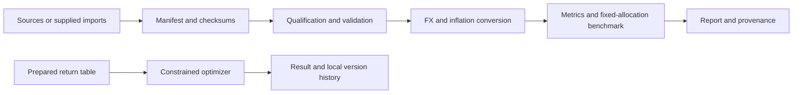

# Auditable Portfolio Lab

An auditable cross-market portfolio research engine built through AI-assisted development, with deterministic validation, explicit data provenance, reproducible reports, and honest limitations.

[](https://github.com/zzhang87/auditable-portfolio-lab/actions/workflows/ci.yml)


> **Synthetic demonstration only.** Every result in this README and chart uses repository-authored synthetic inputs, not historical performance. This is research software, not investment advice; market-data readiness remains incomplete.


## What It Demonstrates

Follow an input from its manifest to an inspectable purchasing-power report. The same workflow makes rejected inputs, unavailable metrics, and incomplete coverage visible.

| Capability | Implementation | Checked-in evidence |
|---|---|---|
| Reject unqualified or altered inputs | [Manifest, metadata, and checksum validation](pcopt/market_data.py) | [Qualification and tamper tests](tests/test_market_data.py) |
| Compare USD and CNY purchasing power | [FX and inflation conversion](pcopt/currency.py) | [Hand-checked currency cases](tests/test_currency.py) |
| Evaluate fixed allocations with explicit assumptions | [Annual rebalancing and benchmark reports](pcopt/benchmark.py) | [Synthetic example report](reports/example/benchmark.md), [benchmark tests](tests/test_benchmark.py) |
| Measure losses from initial wealth | [Drawdown and ulcer-index calculations](pcopt/metrics.py) | [Initial-loss regression](tests/test_metrics.py) |
| Reproduce results and inspect provenance | [Replay handling](pcopt/replay.py), [semantic verifier](pcopt/demo.py) | [Synthetic provenance sidecar](reports/example/benchmark.provenance.json), [replay tests](tests/test_replay.py) |

## Five-Minute Demo

Requires Python 3.10+ and Git. Clone the repository and enter its directory:

```bash
git clone https://github.com/zzhang87/auditable-portfolio-lab.git
cd auditable-portfolio-lab
```

Run from the repository root. Installation requires package access; the benchmark itself runs offline from checked-in synthetic inputs.

```bash
python -m venv .venv
source .venv/bin/activate
pip install -e ".[dev]"
pcopt benchmark \
  --manifest examples/demo/manifest.json \
  --weights examples/demo/portfolio.json \
  --base-currency both \
  --output-dir /tmp/pcopt-demo \
  --allow-synthetic-demo
```

Open `/tmp/pcopt-demo/benchmark.md` for the report, `benchmark.json` for structured results, and `benchmark.provenance.json` for artifact checksums. The [checked-in report](reports/example/benchmark.md) is available without installation. The explicit demo flag allows synthetic inputs while preserving `data_kind: synthetic_test` and incomplete readiness.

## Example Output

**Illustrative synthetic demonstration output, not historical performance.** The [checked-in expected report](examples/demo/expected/benchmark.md) evaluates `balanced_demo` with 60% synthetic growth and 40% synthetic defensive weights, annual rebalancing, and 11 annual observations labeled 2015–2025.

| Purchasing-power view | Nominal CAGR | Real CAGR | Real volatility | Deepest real drawdown |
|---|---:|---:|---:|---:|
| USD | 3.45% | 0.51% | 7.74% | -19.76% |
| CNY | 4.71% | 3.21% | 5.77% | -6.49% |

Currency and inflation assumptions change the purchasing-power view of the same allocation. Drawdown uses year-end observations. Start-date sensitivity and withdrawal metrics remain unavailable because this synthetic interval is too short; the report states the missing horizons and incomplete core coverage.

## How AI Was Used

AI supports research, implementation, and review. Explicit requirements, deterministic checks, and reproducible artifacts define acceptance, with human review of scope and source suitability. Three [engineering case studies](docs/ai-assisted-development.md) connect source qualification, an initial-loss drawdown correction, and reproducible artifacts to code and tests. They document contributions and validation boundaries without claiming measured productivity gains or investment improvements caused by AI.

## Architecture



The [architecture guide](docs/architecture.md) explains component boundaries, rejection rules, and the reproduction contract. The optimizer takes separately prepared returns; its command does not automatically apply benchmark data qualification.

## Evaluation and Reproducibility

Tests cover hand-checked metric invariants, data qualification and tampering, CLI integration, replay portability, synthetic opt-in, visualization, and publication boundaries. The [evaluation guide](docs/evaluation.md) maps these layers to evidence and release gates.

After the demo, check semantic equivalence and generated report checksums:

```bash
python scripts/verify_demo.py \
  --expected examples/demo/expected \
  --actual /tmp/pcopt-demo
```

The demo manifest fixes its qualification cutoff to `2026-01-01`. Verification compares results, provenance, coverage, and readiness; replay display paths have separate tests. Matching checksums establish content identity, not source truth or authenticity. The [expected JSON](examples/demo/expected/benchmark.json) exposes the full calculation output and assumptions.

## Data Boundary and Limitations

The nine-core-asset US/mainland China/Hong Kong milestone is incomplete. Synthetic demo coverage does not establish market coverage. Production readiness requires the full core universe and at least 10 shared complete years; even that dataset milestone does not certify live use.

Raw or licensed third-party inputs are not redistributed here. Adapters confer no data rights; users supply permitted inputs and review source suitability. Annual observations omit intra-year drawdowns, short histories limit horizon metrics, and the synthetic demo omits taxes and transaction costs. A heuristic optimizer does not guarantee a global optimum or a feasible trade plan.

This is research software, **not investment advice**. Live trading, account feasibility, and personalized recommendations are outside scope. See [data terms and known limitations](docs/data-and-limitations.md).

## Other Workflows

- **Constrained optimization:** [GeneticOptimizer](pcopt/optimizer.py) searches supplied return tables using objectives, constraints, and a seed. Inspect result feasibility; see [optimizer tests](tests/test_optimizer.py).
- **Local versioning:** [SQLite storage](pcopt/storage.py) records portfolios, parent/child versions, and optimizer runs. The [CLI](pcopt/cli.py) exposes `version-show`, `version-children`, `version-roots`, and `run-show`.
- **Public-source builders:** [Source adapters](pcopt/market_sources/), the [public proxy builder](scripts/build_public_proxy_returns.py), and the [cross-market builder](scripts/build_us_china_dataset.py) support local data preparation. Data access, qualification, and redistribution terms remain separate requirements.

## Development

With the virtual environment active, install development and optional visualization dependencies, run the full suite and lint checks, then audit the Git-tracked publication set:

```bash
pip install -e ".[dev,viz]"
python -m pytest
ruff check .
python scripts/check_publication.py
```

Stage intended publication files before the final audit. The scanner checks known private-path patterns and relative link targets; manual content and data-rights review remains necessary.

Regenerate the chart from the checked-in synthetic report:

```bash
python scripts/render_demo_chart.py \
  --report reports/example/benchmark.json \
  --output assets/benchmark-overview.png
```

## License

Code is licensed under [MIT](LICENSE). Repository-authored synthetic demo values have separate [CC0-1.0 terms](examples/demo/DATA_LICENSE.md). Neither license grants rights to third-party source data.
